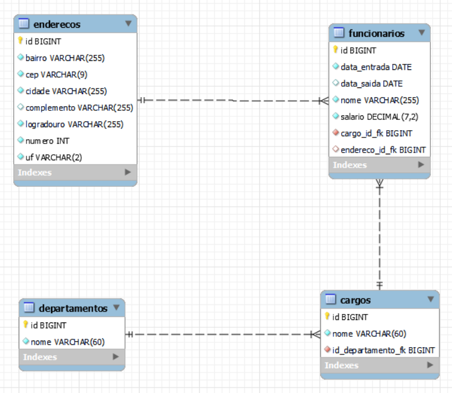

<h1 align="center">🔗 Projeto Web com Spring-Boot, Spring MVC, JPA e Thymeleaf</h1>

<h2 align="center">Curso Udemy: Spring Boot & MVC com Thymeleaf</h2>

## 📝 Descrição  
Este projeto foi desenvolvido como parte do curso **Primeiros Passos no Desenvolvimento Web com Spring Boot, Spring MVC, JPA e Thymeleaf**, ministrado na Udemy. O objetivo principal foi criar uma aplicação web completa utilizando as tecnologias modernas do ecossistema Java, com foco nas funcionalidades do **Spring Boot**, **Spring MVC**, **JPA**, **Thymeleaf** e **Bootstrap 4**.  

Durante o curso, foram implementadas diversas funcionalidades essenciais para o desenvolvimento de aplicações web:  

- **CRUD (Create, Retrieve, Update, Delete)**: Operações básicas para manipulação de dados.  
- **Validação de Dados**: Integração do **Hibernate Validator** e **Bean Validation**, além da criação de validações personalizadas com o **Spring Validator**.  
- **Padrão DAO**: Aplicação do padrão **Data Access Object (DAO)** utilizando **JPA** para persistência de dados.  
- **Paginação e Ordenação**: Recurso backend para exibição paginada de registros em tabela, com suporte a ordenação por colunas, seleção de quantidade de registros por página e busca por campo específico.  

A aplicação combina uma arquitetura robusta no backend com uma interface dinâmica, utilizando **Bootstrap 4** para uma experiência de usuário responsiva e eficiente.  

---

## 🎯 Objetivos Alcançados  

- Configuração de aplicações com **Spring Boot**  
- Desenvolvimento de APIs web com **Spring MVC**  
- Mapeamento objeto-relacional com **JPA**  
- Implementação da camada de persistência com o padrão **DAO**  
- Validação de formulários no servidor com **Bean Validation**  
- Utilização de **Thymeleaf** para criação de views dinâmicas  
- Gerenciamento de recursos estáticos (CSS e JS) com **WebJars**  
- Paginação, ordenação e filtragem de dados backend  

---

## 🚀 Habilidades Desenvolvidas  

- Criação de aplicações completas com **Spring Boot**  
- Implementação de validações personalizadas com **Spring Validator**  
- Manipulação eficiente de tabelas com paginação backend  
- Integração de frontend estilizado com **Bootstrap 4**  
- Melhor compreensão do padrão **DAO** e boas práticas em persistência de dados

---

## 📊 Diagrama de Modelagem do Banco de Dados  
  

---

## 📦 Estrutura do Projeto

```java
projeto-springthymeleaf
├── src
│ └── main
│ ├── java
│ │ └── com
│ │ └── udemy
│ │ └── projeto
│ │ └── springthymeleaf
│ │ ├── dao # Camada de acesso aos dados (Data Access Object)
│ │ ├── entities # Entidades JPA representando tabelas do banco de dados
│ │ ├── service # Regras de negócio e lógica de aplicação
│ │ ├── util # Utilitários auxiliares da aplicação
│ │ └── web
│ │ ├── controllers # Controladores para gerenciar as requisições
│ │ ├── conversor # Conversores personalizados para dados
│ │ ├── error # Manipulação de erros
│ │ └── validator # Validações personalizadas
│ │ └── WebApplication.java # Classe principal da aplicação
│ └── resources
│ └── ... (recursos estáticos, templates, etc.)
```
---

🏆 [Certificação](https://www.udemy.com/certificate/UC-bba7be7d-2f72-4117-a5c3-8df9566f97b0/)

---

## Conclusão

Este projeto proporcionou uma excelente oportunidade para aplicar na prática os conhecimentos adquiridos sobre o desenvolvimento web com o ecossistema Spring Framework. Sob a orientação do professor [Márcio Ballem](https://www.linkedin.com/in/mballem/), aprendi a configurar aplicações com Spring Boot, implementar operações CRUD com Spring MVC e JPA, validar dados de formulários com Hibernate Validator, além de criar páginas dinâmicas utilizando Thymeleaf e Bootstrap 4. A combinação desses conceitos permitiu consolidar uma base sólida para desenvolver aplicações robustas e escaláveis

---
📌 **Autor**  

👨‍💻 Albert Silva
